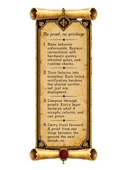

# attestation-service

verifiable eat receipts for arbitrary source.

submit a source tarball; an ephemeral **intel tdx** vm shadow-builds it inside
the tee and returns a signed **eat** receipt that binds the build output to a
hardware quote. the build host is not trusted — only the cpu vendor root is.

it is also the demo surface for the lower layers: it issues stage0 (build) and
stage1 (runtime) eat receipts that chain, and it cryptographically verifies real
aws nitro / amd sev-snp / intel tdx quotes against pinned vendor roots — the same
check `uq` runs. the eat format and verifier are a direct cargo dependency on
[unified-quote](https://github.com/maceip/unified-quote) (not vendored), so this
service verifies with exactly the same code the base layer ships — including the
azure path, where a sev-snp report is read from the vTPM and rooted to the amd
ark (no MAA). the base layer runs three live, remotely re-verifiable nodes today
(aws sev-snp, aws nitro, azure sev-snp): https://maceip.github.io/unified-quote/live.html

## run

```bash
cargo build --release --bin attestation-service
./target/release/attestation-service        # listens on 127.0.0.1:8080
```

## endpoints

- `POST /v1/attest` — submit a source tarball (`--data-binary @app.tar.gz`, or
  multipart `src=@app.tar.gz`); get a stage0 receipt. chain a runtime onto a
  build by passing the previous eat: header `x-previous-eat: <base64 cbor>`.
- `POST /v1/verify` — verify an eat (raw cbor or base64) and its full
  build→runtime chain against the pinned vendor roots.
- `GET /v1/receipt/{id}` · `GET /healthz`.

## demo (no tee required)

```bash
./scripts/demo.sh
```

issues a witness receipt for sample source, then cryptographically verifies the
bundled real tdx (stage0→stage1 chain) and aws nitro quotes against pinned vendor
roots — entirely offline.

## source → silicon (live)

this repo is built **inside** an azure sev-snp confidential vm by a self-hosted
github runner ([`.github/workflows/attest-in-tee.yml`](.github/workflows/attest-in-tee.yml)),
so the build host itself is hardware-attested — not merely trusted because it is
managed. the workflow:

1. builds `attestation-service` in the tee → artifact digest `D = sha256(bin)`;
2. emits **github build provenance** (sigstore) attesting `D` was built from this
   commit by this workflow;
3. binds the same `D` as `value_x` into the cvm's amd-rooted vTPM ak quote and
   serves it; the artifact + hardware bundle are published to the
   `azure-tee-build` release.

two independent roots — sigstore supply-chain and amd hardware — meet at one
`value_x`. one command checks both and asserts they agree:

```bash
./scripts/verify-source-to-silicon.sh
# [1/4] azure sev-snp → amd root  · value_x_bound true
# [2/4] download release artifact
# [3/4] gh attestation verify     · provenance from maceip/attestation-service (self-hosted, in-tee)
# [4/4] D == value_x              · PASS: source → silicon
```

## running inside attested-workload

the service binds `127.0.0.1:8080` and serves `/v1/*` + `/healthz`, so it drops
straight into [attested-workload](https://github.com/maceip/attested-workload)'s
loopback app-proxy — its own responses are then served over attested tls. set
`AS_QUOTE_CMD` + `AS_PLATFORM` to collect real hardware quotes; otherwise receipts
are honest software witnesses (never faked). see `deploy/attested-workload.md`.

## the stack

- agent platform — [cvm-agent](https://github.com/maceip/cvm-agent)
- attestation service — **attestation-service** (here)
- quote format — [unified-quote](https://github.com/maceip/unified-quote)
- in-tee runtime — [attested-workload](https://github.com/maceip/attested-workload)

pages: https://maceip.github.io/attestation-service/

<!-- agentic-canon -->
## agentic canon

<table>
<tr>
<td width="200" valign="top"></td>
<td valign="top">

**no proof, no privilege.**

1. **make behavior enforceable.** replace conventions with hardware quotes, attested gates, and runtime checks.
2. **turn failures into evolution.** each failed verification hardens the shared verifier, not just one deployment.
3. **compose through proofs.** every layer declares what it accepts, returns, and can prove.
4. **carry trust forward.** a proof from one stage becomes the ground the next stands on.

</td>
</tr>
</table>
